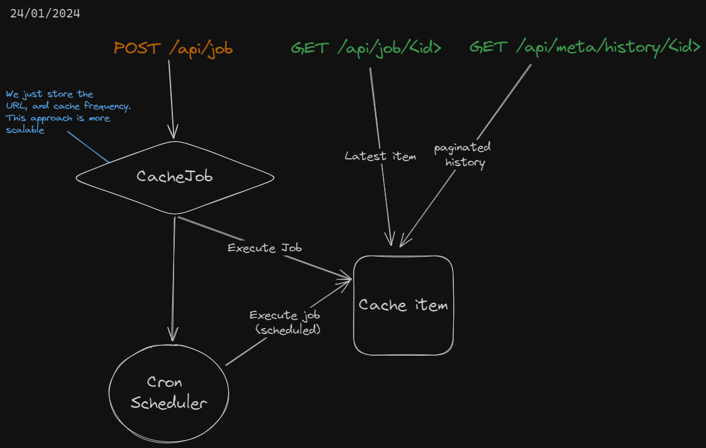

# Cache it pls!

- [Setup](#setup)
- [Distinctiveness and Complexity](#distinctiveness-and-complexity)
- [How it works](#how-it-works)
- [Breakdown of the code](#code)
  - [Front-End](#front-end)
  - [Core](#core)
  - [OAuth](#oauth)
  - [Rest API](#rest-api)
- [Demo](#demo)

Turn your rate-limited APIs into unlimited cached APIs through a dead-simple UI.

> This is alo Aadvik's CS50w's final project!

## Setup

**Accquire necessary environment variables**

```env
GOOGLE_OAUTH_CALLBACK_URL = "http://localhost:8000/oauth/google/callback"

GOOGLE_OAUTH_CLIENT_ID = "your_client_id"
GOOGLE_OAUTH_CLIENT_SECRET = "your_client_secret"
```

To accquire these go to [Google cloud console](https://console.cloud.google.com)

**Build the enviorment**

```powershell
python -m venv env
.\env\Scripts\Activate.ps1
```

**Run the application**

```powershell
pip install -r requirements.txt
python manage.py migrate
python manage.py runserver
```

## Distinctiveness and Complexity

This service was built as a response to a problem I came across when using [GitHub's highly rate-limited RestAPI](https://docs.github.com/en/rest/using-the-rest-api/rate-limits-for-the-rest-api), the solution to this would be to cache the responses which would require 18-20 fully-tested, bug-free lines of code AND a storage solution (Local, SQL); **Cache it pls!** tries to abstract away this process and spit out a single URL you can reliably call to your hearts content.

Unlike previous challenges of [CS50 Web](https://github.com/aadv1k/cs50) which were "web apps" this tries to be a useful, real-world micro-service to aid in building larger applications.

## How it works



## Code

The django project comprises of 3 apps, which look like so

### front-end 

The site is developed using [bulma](https://bulma.io/) along with some vanilla JavaScript to glue everything together.

- `core/static/core/dashboard.js`: handles the Front-End logic for `/dashboard` view
- `core/static/core/vendor/`: holds the static files for bulma and [bulma darkly theme](https://jenil.github.io/bulmaswatch/darkly/) 

### core

> At: [`core/`](./core)

Glues and holds the back-end logic and the UI together. It handles the following URLs

- `/index`
- `/dashboard` renders a SPA-ish app that holds all logic for deleting, adding jobs. See [Rest API](#rest-api) below
- `/logout`

## oauth

> At: [`oauth/`](./oauth)

The OAuth is implemented for Google only, and is a singular endpoint to both login + signup user

- `/oauth/google`
- `/oauth/google/callback`

### Rest API

> At: [`api/`](./api)

This API is responsible for controlling the client-facing actions for a cache job. The API looks like so

#### `POST /api/job`

- Requires authentication

**Example Body**

```javascript
{
  url: "https://api.kanye.rest",
  time_int: 5,
  time_frame: "minutes"
}
```

**Constraints**

- The `URL` **must** return `application/json` when pinged at `HEADER <url>` a 400 is returned otherwise
- The `time_frame` must be one of `minutes`, `hours`, `days` a 400 is returned otherwise


#### `DELETE  /api/job/<id>`

- Requires authentication

**No Body**

**Constraints**

- If the `id` is invalid, a 404 will be returned

#### `GET /api/job/<id>`

returns the last cached JSON field

**No Body**
